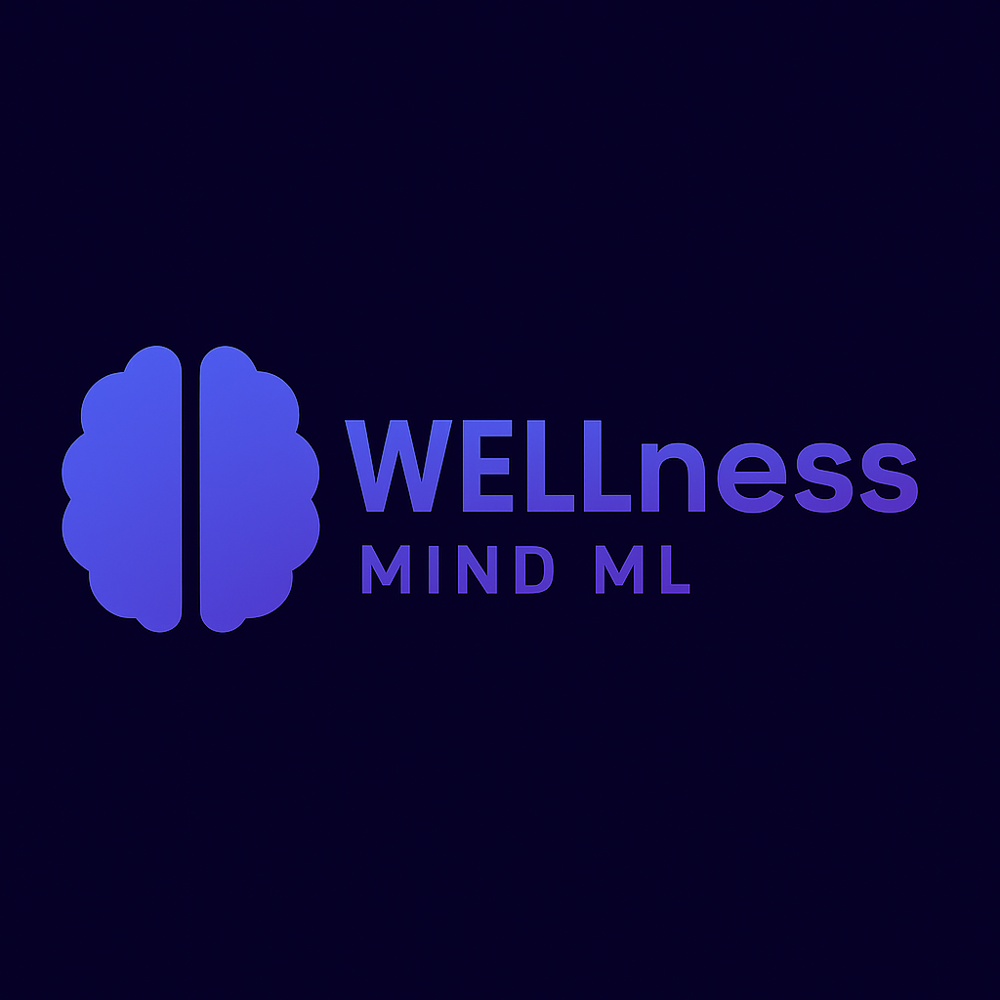

<div align="center">

# WELLness 🧠 – ML Powered Sentiment Analysis Web App
</div>

<div align="center">
  

  **Intelligent Web-Based ML Powered Sentiment Analyzer Tool for Individuals** 📚✨
  
  [](https://python.org)
  [](https://flask.palletsprojects.com)
  [](LICENSE)
  
</div>

WELLness is an intelligent and user-friendly web application that leverages MACHINE LEARNING to analyze the sentiment behind your thoughts and expressions. With a simple and elegant interface, this application enables users to enter a message or feeling and receive instant feedback about the emotional tone - whether it's positive, negative, or neutral.

## 🌟 Features

- 🧠 Built using a trained ML model (joblib-based)
- 💻 Flask-based backend
- 🎨 Stylish, responsive frontend UI with dark theme and polished CSS
- 📝 Real-time sentiment prediction from text
- 📚 “About” and “Instructions” sections for users
- 🌐 Fully deployable as a single-page web application

## 📂 Project Structure

```
WELLness/
├── app.py
├── model.pkl
├── static/
│   ├── style.css
├── templates/
│   └── index.html
├── requirements.txt
└── README.md
```

## ⚙️ How to Run Locally

1. **Clone the repository**

   ```bash
   git clone https://github.com/yuvanyegireddi/WELLness
   cd WELLness
   ```
2. **Create a virtual environment (optional but recommended)**

   ```bash
   python -m venv venv
   source venv/bin/activate  # On Windows: venv\Scripts\activate
   ```
3. **Install dependencies**

   ```bash
   pip install -r requirements.txt
   ```
4. **Run the application**

   ```bash
   python app.py
   ```
5. **Open your browser and go to**

   ```
   http://127.0.0.1:5000
   ```

## 🚀 Deployment Instructions

You can deploy WELLness using platforms like **Render**, **Heroku**, or **Vercel with backend functions**.

- Make sure `model.pkl`, `app.py`, and dependencies are present.
- Follow platform-specific instructions for Flask app deployment.

## 🧠 About the App

This project was built for a hackathon to demonstrate how Machine Learning can be used to detect the mental state of a user based on their messages. It uses a CUSTOM ML model trained on a sentiment-labelled dataset acquired from KAGGLE 

🔗Link to the Dataset Used: "https://www.kaggle.com/datasets/suchintikasarkar/sentiment-analysis-for-mental-health"

🔗Link to the Google Colab Notebook: "https://colab.research.google.com/drive/11j8Obtap3SAMtm8K896imJbn_WJ_YjDo?usp=sharing"

🔗Link to the YouTube Video Demo: "https://youtu.be/FGAFDNekNh0"

## 🛠 Technologies Used

- Google Colab (Training the Custom ML Model)
- Python, Flask
- Scikit-learn, Joblib
- HTML5, CSS3 (custom styled)

---

**Made with ❤️ for Mental Wellness with the Power of ML.**

